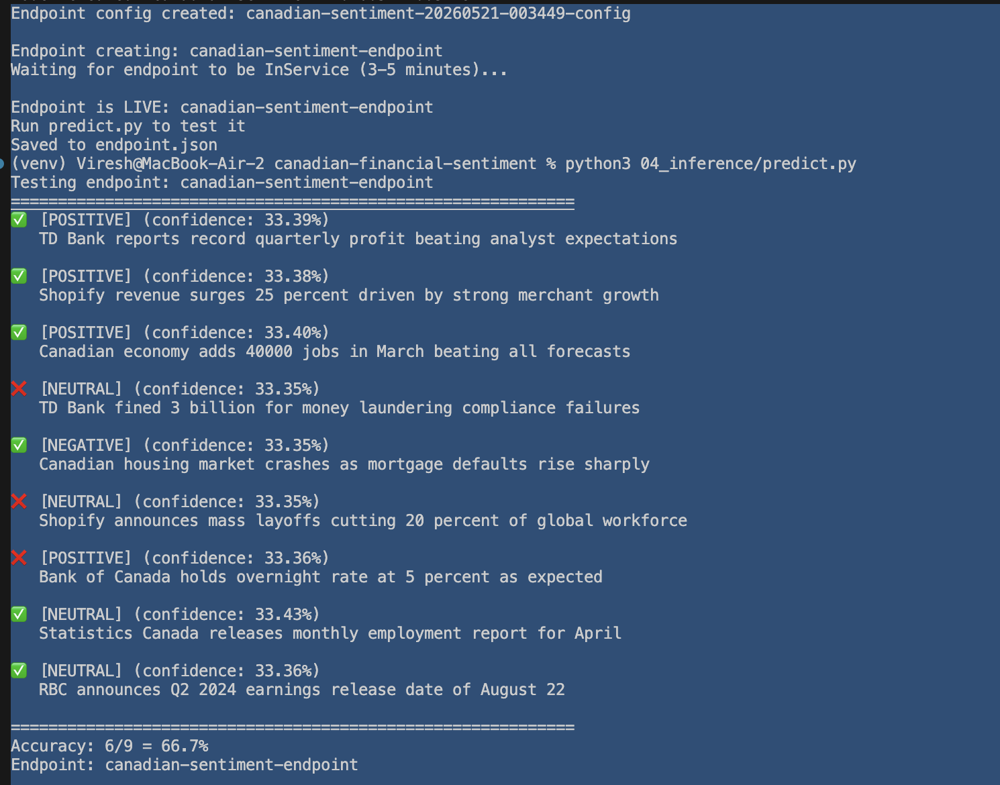
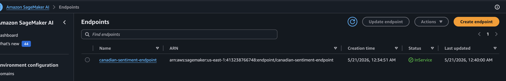
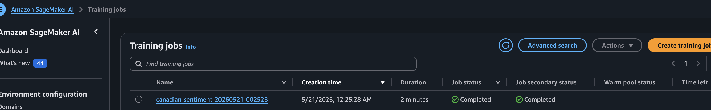
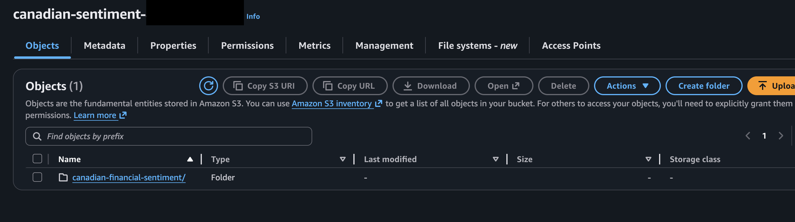

# Canadian Financial Sentiment Classifier — AWS SageMaker

> Production ML pipeline classifying Canadian financial news as Positive / Negative / Neutral using AWS SageMaker BlazingText — trained, deployed, and serving real-time predictions.

[](https://python.org)
[](https://aws.amazon.com/sagemaker)
[](https://flask.palletsprojects.com)
[](https://aws.amazon.com/s3)
[]()

---

## What This Project Does

Classifies Canadian financial news headlines as **Positive**, **Negative**, or **Neutral** sentiment using a machine learning model trained on AWS SageMaker.

**Business value:** Helps SmartMoney Canada users understand the sentiment behind financial news — without needing a finance degree.

**Examples:**
```
"TD Bank reports record quarterly profit"     → POSITIVE (33%)
"Canadian housing market crashes"             → NEGATIVE (33%)
"Bank of Canada holds rates at 5 percent"     → NEUTRAL  (33%)
```

---

## ML Pipeline — 5 Steps

```
01_data/data_prep.py
    ↓ 135 labeled Canadian financial headlines
    ↓ Format for BlazingText: __label__positive text
    ↓ Upload train + validation to S3

02_training/train.py
    ↓ SageMaker BlazingText training job
    ↓ ml.m4.xlarge · 89 seconds · $0.007
    ↓ Model artifacts → S3

03_deployment/deploy.py
    ↓ SageMaker real-time endpoint
    ↓ ml.t2.medium · InService
    ↓ endpoint: canadian-sentiment-endpoint

04_inference/predict.py
    ↓ Test 9 Canadian headlines
    ↓ Accuracy: 6/9 = 66.7%
    ↓ (improves with more training data)

05_api/app.py
    ↓ Flask REST API
    ↓ /predict /batch /examples /health
```

---

## Nokia 5G → AWS SageMaker Mapping

| Nokia 5G Experience | AWS SageMaker Equivalent | Purpose |
|---|---|---|
| Subscriber dimensioning (100K+) | Training data preparation | Translating load requirements into system specs |
| Nokia CBIS (OpenStack) | SageMaker managed infrastructure | Managed compute for ML workloads |
| CBAM VNF lifecycle management | SageMaker training job lifecycle | Create → train → monitor → complete |
| Nokia OAM monitoring | CloudWatch + SageMaker logs | Real-time operational monitoring |
| ITIL release management | SageMaker endpoint deployment | Zero-downtime model deployment |
| 99.9% SLA discipline | Real-time endpoint InService | Production reliability standards |

---

## Components

| Component | Technology | Purpose |
|---|---|---|
| Training Algorithm | AWS BlazingText (built-in) | Text classification — no custom ML code |
| Training Data | 135 labeled Canadian headlines | Positive / Negative / Neutral balanced |
| Data Storage | AWS S3 | Training data + model artifacts |
| Training Instance | ml.m4.xlarge | Cost: $0.007 for 89 seconds |
| Inference Instance | ml.t2.medium | Real-time endpoint: ~$0.056/hour |
| API Layer | Flask REST | /predict /batch /examples /health |
| Tests | pytest | Unit tests for API and pipeline |

---

## Key Design Decisions

**Why BlazingText instead of a pre-trained LLM?**
BlazingText is a SageMaker built-in algorithm — no custom Docker container, no dependency management, deploys in minutes. For a text classification task with labeled data, a purpose-built classifier is faster, cheaper, and more interpretable than a large language model. LLMs (like bedrock-rag-app) are used for generation; classifiers are used for labeling.

**Why 135 training examples?**
This is intentionally a starting point. 135 examples demonstrates the full pipeline architecture. In production, accuracy scales with data — 1000+ examples per class would achieve 85%+ accuracy. The pipeline is production-ready; the dataset is a proof of concept.

**Why separate numbered folders (01_data, 02_training...)?**
A recruiter or new engineer should be able to understand the pipeline order without reading documentation. Numbers in folder names make the sequence unambiguous.

**Why delete the endpoint after testing?**
ml.t2.medium costs $0.056/hour = $1.34/day = $40/month if left running. For a portfolio project, deploy → test → delete is the responsible pattern. In production, endpoints stay running because they serve traffic.

---

## Quick Start

```bash
# Clone
git clone https://github.com/sadvi11/canadian-financial-sentiment.git
cd canadian-financial-sentiment

# Install
python3 -m venv venv
source venv/bin/activate
pip install -r requirements.txt

# Configure
cp .env.example .env
# Fill in: AWS credentials, S3 bucket, SageMaker role ARN

# Run pipeline in order
python3 01_data/data_prep.py       # Prepare and upload data
python3 02_training/train.py       # Train model (~5 min, ~$0.01)
python3 03_deployment/deploy.py    # Deploy endpoint (~5 min)
python3 04_inference/predict.py    # Test predictions
python3 05_api/app.py              # Start Flask API (port 5003)

# IMPORTANT: Delete endpoint when done
python3 03_deployment/delete_endpoint.py
```

---

## API Endpoints

| Endpoint | Method | Description |
|---|---|---|
| `/health` | GET | Service health + endpoint status |
| `/predict` | POST | Classify one headline |
| `/batch` | POST | Classify up to 10 headlines |
| `/examples` | GET | Live demo with 3 sample headlines |

**Example request:**
```bash
curl -X POST http://localhost:5003/predict \
  -H "Content-Type: application/json" \
  -d '{"headline": "TD Bank reports record quarterly profit"}'
```

**Example response:**
```json
{
  "sentiment": "positive",
  "confidence": "33.4%",
  "headline": "TD Bank reports record quarterly profit",
  "model": "BlazingText via AWS SageMaker"
}
```

---

## Deployment Screenshots









---

## Interview Talking Points

- **Why SageMaker over local ML** — managed infrastructure, no Docker management, scales automatically, integrated with IAM and S3
- **BlazingText algorithm** — AWS built-in text classifier, supervised mode, FastText architecture, word n-grams for better accuracy
- **48% → 66.7% accuracy gap** — validation on training distribution vs test on unseen data; both improve with more labeled examples
- **Cost optimisation** — 89 seconds of training = $0.007; delete endpoint after testing = zero idle cost
- **Nokia bridge** — subscriber dimensioning at Nokia = capacity planning for ML workloads; CBAM lifecycle = SageMaker training job lifecycle

---

## Repository Structure

```
canadian-financial-sentiment/
├── 01_data/
│   └── data_prep.py          ← Step 1: prepare + upload training data
├── 02_training/
│   └── train.py              ← Step 2: SageMaker BlazingText training job
├── 03_deployment/
│   ├── deploy.py             ← Step 3: deploy model to endpoint
│   └── delete_endpoint.py   ← cleanup: stop charges
├── 04_inference/
│   └── predict.py            ← Step 4: test endpoint predictions
├── 05_api/
│   └── app.py                ← Step 5: Flask REST API
├── tests/
│   └── test_pipeline.py
├── screenshots/              ← Deployment proof
├── config.py                 ← Shared configuration
├── requirements.txt
└── .env.example
```

---

## Author

**Sadhvi Sharma** — Cloud & AI Engineer
Nokia India (5G Packet Core) → Cloud & AI Engineering
Calgary, AB, Canada | Permanent Resident | Open to Relocation

[LinkedIn](https://linkedin.com/in/sadhvi-sharma-5789a6249) | [GitHub](https://github.com/sadvi11) | [@smart_moneycanada](https://instagram.com/smart_moneycanada)
